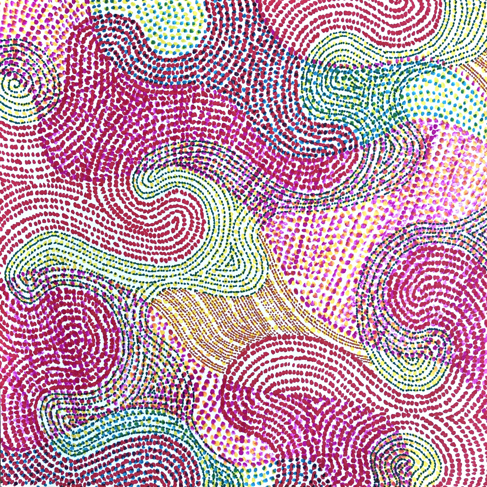
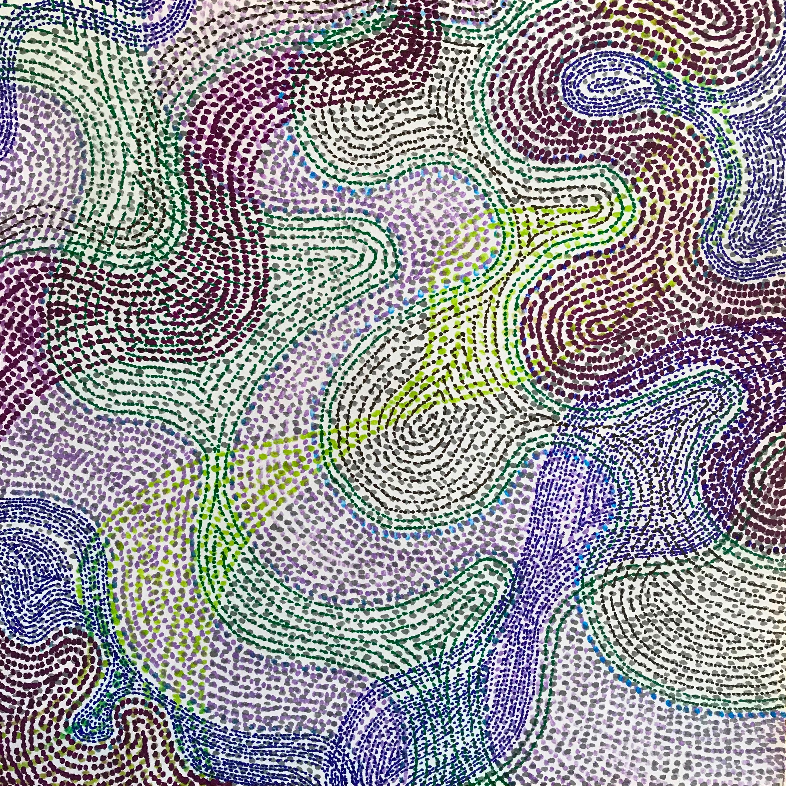
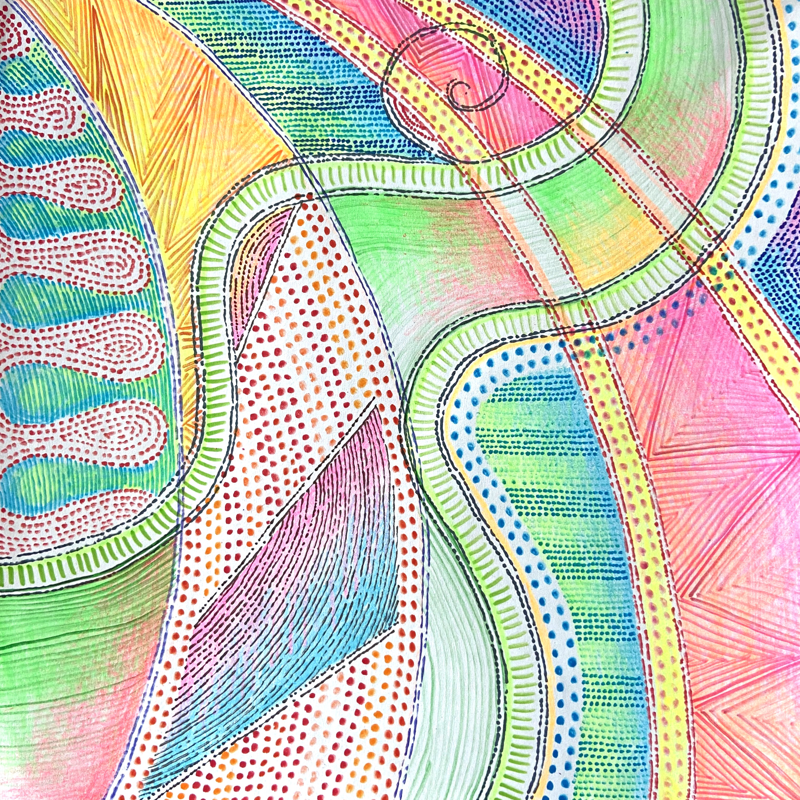
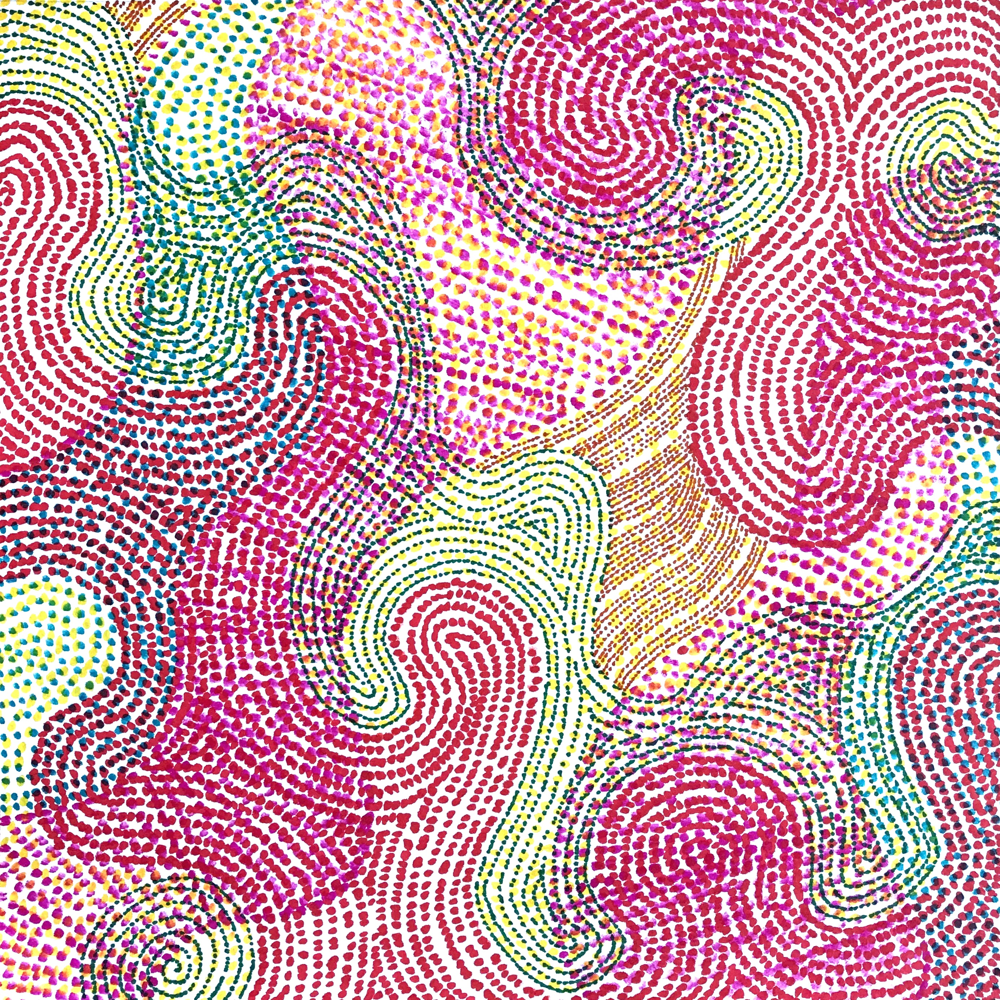
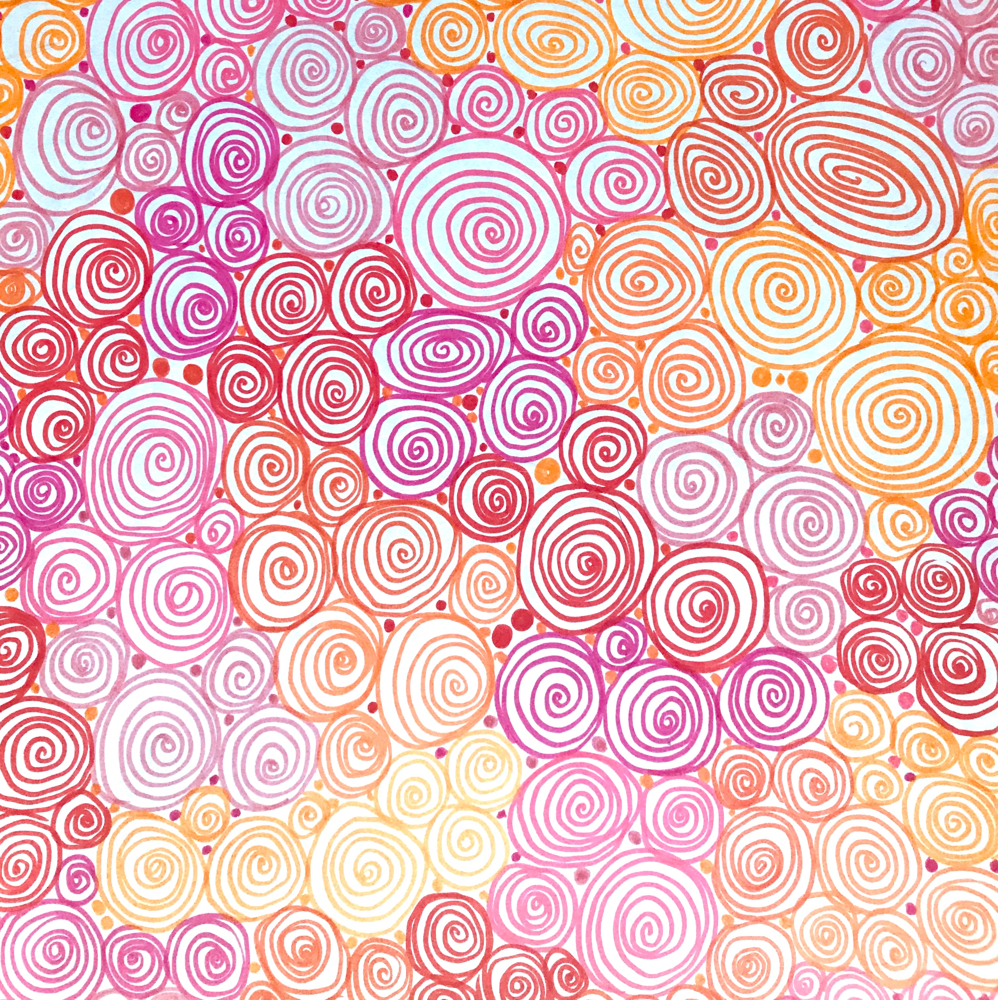
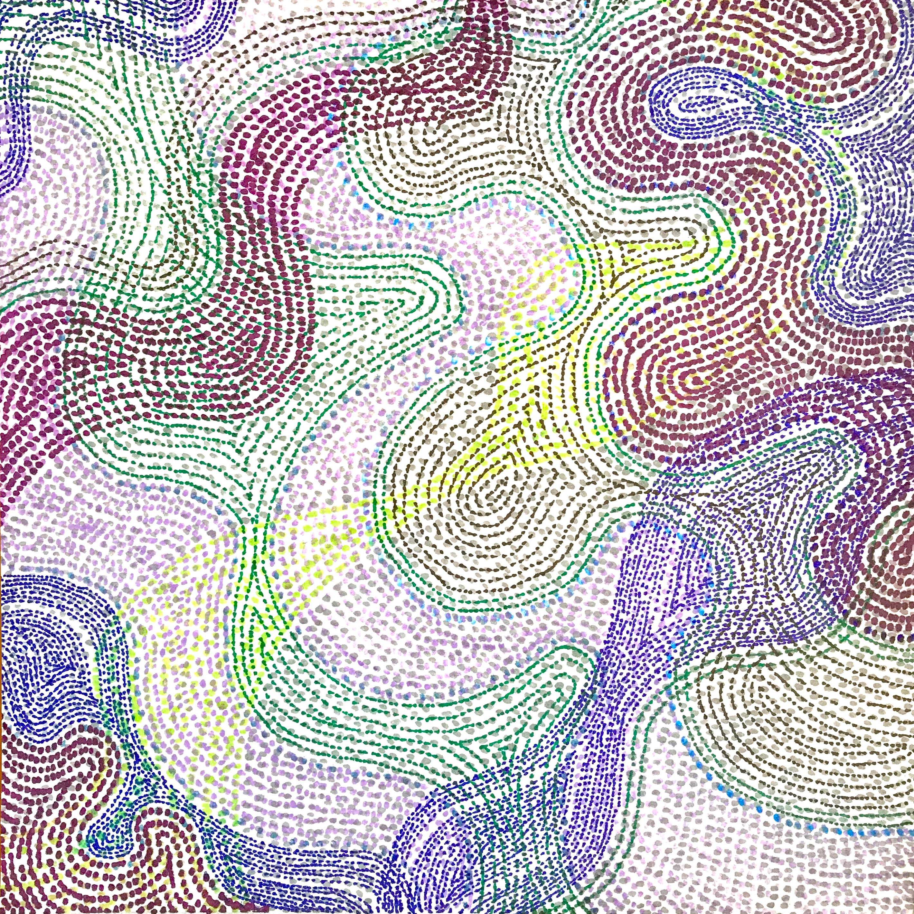

## Kara Weisman

[**email**: [kgweisman at gmail](mailto:kgweisman@gmail.com)] [**twitter**: [@kgweisman](https://twitter.com/kgweisman)] [**cv**: [pdf]({{ kgweisman.github.io }}/pub_files/Weisman_CV_2022-01-04.pdf)]

I study intuitive theories, conceptual change, and folk philosophy of mind, with particular attention to the ways these conceptual representations do and do not vary across development, across cultural settings, and across individuals. I am currently the postdoctoral project director for the [Developing Belief Network](https://www.developingbelief.com/).

* [HOME]({{ kgweisman.github.io }}/index)
* [ABOUT ME]({{ kgweisman.github.io }}/about)
* [PUBLICATIONS]({{ kgweisman.github.io }}/publications)
* [TEACHING]({{ kgweisman.github.io }}/teaching)
* [ART]({{ kgweisman.github.io }}/art)

I like to doodle. In the past few years I have been exploring the tensions between precision and approximation, logic and intuition, planning and spontaneity. These pieces were drawn freehand using some combination of ink and colored pencil, with no rulers or digital manipulation. 

If you'd like to use any of my art, please [email me](mailto:kgweisman@gmail.com). All images © 2022, Kara Weisman.

