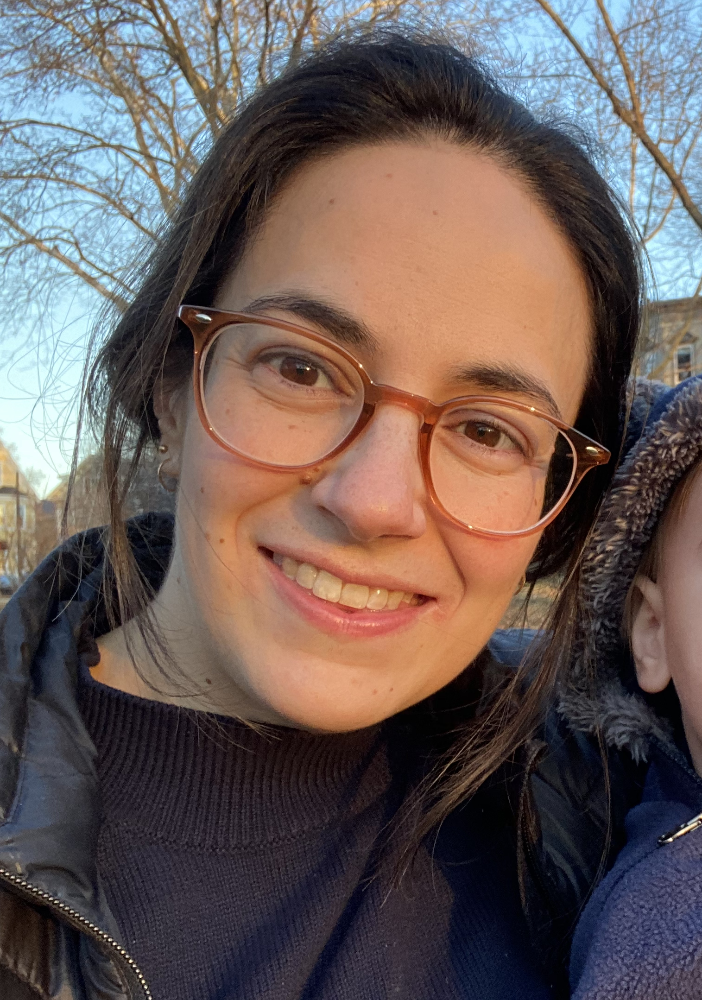
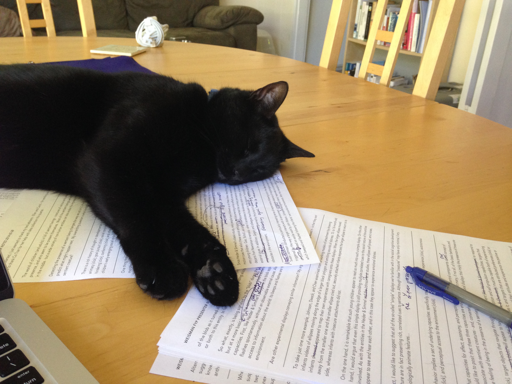
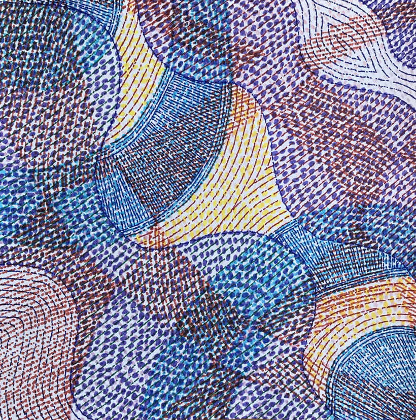

## Kara Weisman

[**email**: [kgweisman at gmail](mailto:kgweisman@gmail.com)] [**cv**: [pdf]({{ kgweisman.github.io }}/pub_files/Weisman_CV_2024-12-17.pdf)]

I study folk theories and their role in shaping people’s behaviors, relationships, and experiences. I am particularly interested in the ways in which conceptual representations do and do not vary across development, across cultural settings, and across individuals. I am currently the postdoctoral project director for the [Developing Belief Network](https://www.developingbelief.com/). 

In Summer 2025, I will begin a new position as a preceptor of quantitative psychology in the Psychology Department at Harvard University.

* [HOME]({{ kgweisman.github.io }}/index)
* [ABOUT ME]({{ kgweisman.github.io }}/about)
* [PUBLICATIONS]({{ kgweisman.github.io }}/publications)
* [TEACHING]({{ kgweisman.github.io }}/teaching)
* [ART]({{ kgweisman.github.io }}/art)

