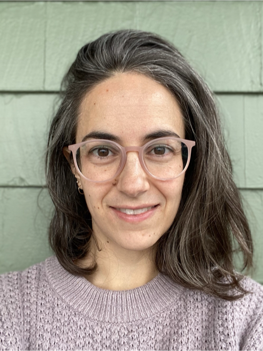

## Kara Weisman

[**email**: [kgweisman at gmail](mailto:kgweisman@gmail.com)] [**twitter**: [@kgweisman](https://twitter.com/kgweisman)] [**cv**: [pdf]({{ kgweisman.github.io }}/pub_files/Weisman_CV_2021-07-26.pdf)]

I study intuitive theories, conceptual change, and folk philosophy of mind, with particular attention to the ways these conceptual representations do and do not vary across development, across cultural settings, and across individuals. I am currently the postdoctoral project director for the [Developing Belief Network](https://www.developingbelief.com/).

* [HOME]({{ kgweisman.github.io }}/index)
* [ABOUT ME]({{ kgweisman.github.io }}/about)
* [PUBLICATIONS]({{ kgweisman.github.io }}/publications)
* [TEACHING]({{ kgweisman.github.io }}/teaching)

