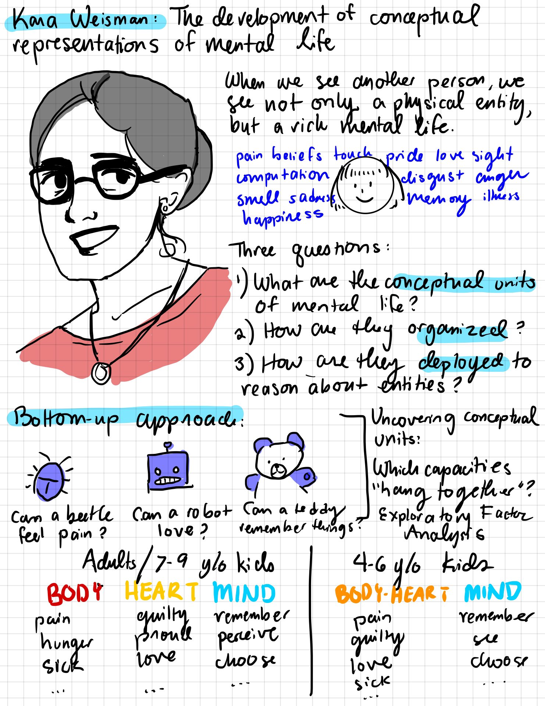
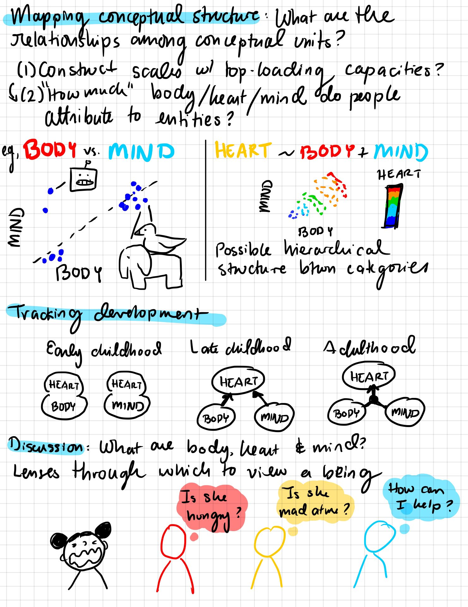

## Kara Weisman

[**email**: [kgweisman at gmail](mailto:kgweisman@gmail.com)] [**cv**: [pdf]({{ kgweisman.github.io }}/pub_files/Weisman_CV_2024-12-17.pdf)]

I study folk theories and their role in shaping people’s behaviors, relationships, and experiences. I am particularly interested in the ways in which conceptual representations do and do not vary across development, across cultural settings, and across individuals. I am currently the postdoctoral project director for the [Developing Belief Network](https://www.developingbelief.com/). 

In Summer 2025, I will begin a new position as a preceptor of quantitative psychology in the Psychology Department at Harvard University.

* [HOME]({{ kgweisman.github.io }}/index)
* [ABOUT ME]({{ kgweisman.github.io }}/about)
* [PUBLICATIONS]({{ kgweisman.github.io }}/publications)
* [TEACHING]({{ kgweisman.github.io }}/teaching)
* [ART]({{ kgweisman.github.io }}/art)

### Publications

**_Click [here]({{ kgweisman.github.io }}/pub_files/Weisman_CV_2024-12-17.pdf) to view my full CV._** _Most of my papers are available on my [Google Scholar profile](https://scholar.google.com/citations?user=Ythhby0AAAAJ&hl=en). Analysis code for many studies is available on [Github](https://github.com/kgweisman). Materials and preregistrations for many projects are available via [OSF](https://osf.io/6vq98/). Please [email me](mailto:kgweisman@gmail.com) with questions, comments, and ideas._

#### Journal Articles

1. **Weisman, K.**, & Luhrmann, T.M. (accepted). Switching between models of mind: New insights into how human minds give rise to experiences of spiritual presence and alternative realities. _Topics in Cognitive Science_.

2. Schille-Hudson, E.B., **Weisman, K.**, & Luhrmann, T.M. (in press). Prayer and perceptual (and other) experiences. _Cognitive Science_.

3. **Weisman, K.**\*, Ghossainy, M.E.\*, Williams, A.J., Payir, A., Lesage, K.A., Reyes-Jaquez, B., Amin, T.G., Anggoro, F.K., Burdett, E.R.R., Chen, E.E., Coetzee, L., Coley, J.D., Dahl, A., Dautel, J.B., Davis, H.E., Davis, E.L., Diesendruck, G., Evans, D., Feeney, A., Gurven, M., Jee, B.D., Kramer, H.J., Kushnir, T., Kyriakopoulou, N., McAuliffe, K., McLaughlin, A., Nichols, S., Nicolopoulou, A., Rockers, P.C., Shneidman, L., Skopeliti, I., Srinivasan, M., Tarullo, A.R., Taylor, L.K., Yu, Y., Yucel, M., Zhao, X., Corriveau, K.H., & Richert, R.A., on behalf of the Developing Belief Network (2024). The development and diversity of religious cognition and behavior: Protocol for Wave 1 data collection with children and parents by the Developing Belief Network. _PLOS ONE_, _19_(3): e0292755. [*joint first authors] [[link](https://journals.plos.org/plosone/article?id=10.1371/journal.pone.0292755)]

4. Powell, D., **Weisman, K.**, & Markman, E.M. (2023). Modeling and leveraging intuitive theories to improve vaccine attitudes. _Journal of Experimental Psychology: General_, _152_(5), 1379-1395. [[link](https://psycnet.apa.org/doiLanding?doi=10.1037%2Fxge0001324)] [[github repo, including fully reproducible manuscript and supplemental materials](https://github.com/derekpowell/int-theory-vacc)]

5. Luhrmann, T.M., & **Weisman, K.** (2022). Porosity is the heart of religion. _Current Directions in Psychological Science_, _31_(3), 247-253. [[link](https://journals.sagepub.com/doi/abs/10.1177/09637214221075285)]

6. Richert, R.A., **Weisman, K.**, Lesage, K.A., Ghossainy, M.E., Reyes-Jaquez, B., & Corriveau, K.H. (2022). Belief, culture, & development: Insights from studying the development of religious beliefs and behaviors. _Advances in Child Development and Behavior_, _62_, 127-158. [[link](https://www.sciencedirect.com/science/article/abs/pii/S0065240721000410)] [[preprint](https://psyarxiv.com/653uy/)]

7. **Weisman, K.**, Legare, C.H., Smith, R.E., Dzokoto, V.A., Aulino, F., Ng, E., Dulin, J.D., Ross-Zehnder, N., Brahinsky, J.D., & Luhrmann, T.M. (2021). Similarities and differences in concepts of mental life among adults and children in five cultures. _Nature Human Behaviour_, _5_, 1358–1368. [[github repo](https://github.com/kgweisman/mental-life-culture-development)] [[link](https://www.nature.com/articles/s41562-021-01184-8)] [[open-access link](https://rdcu.be/cv9Tj)] [[PDF]({{ kgweisman.github.io }}/pub_files/Weisman%20et%20al.%20(2021).pdf)] [[Supplemental Info]({{ kgweisman.github.io }}/pub_files/Weisman%20et%20al.%20(2021)%20-%20SI.pdf)] [[News & Views piece by Bertram Malle](https://www.nature.com/articles/s41562-021-01183-9)]

8. Van Leeuwen, N., **Weisman, K.**, & Luhrmann, T.M. (2021). To believe is not to think: A cross-cultural finding. _Open Mind: Discoveries in Cognitive Science_, _5_, 91–99. [[github repo](https://github.com/kgweisman/think_believe)] [[link](https://direct.mit.edu/opmi/article/doi/10.1162/opmi_a_00044/106928/To-Believe-Is-Not-to-Think-A-Cross-Cultural)] 

9. Luhrmann, T.M.\*, **Weisman, K.**\*, Aulino, F., Brahinsky, J.D., Dulin, J.C., Dzokoto, V.A., Legare, C.H., Lifshitz, M., Ng., E., Ross-Zehnder, N., & Smith, R.E. (2021). Sensing the presence of gods and spirits across cultures and faiths. _Proceedings of the National Academy of Sciences_, _118_(5), e2016649118.  [*joint first authors] [[github repo](https://github.com/kgweisman/sense_spirit)] [[link](https://www.pnas.org/content/118/5/e2016649118)] [[pdf]({{ kgweisman.github.io }}/pub_files/Luhrmann,%20Weisman,%20et%20al.%20(2021).pdf)] [[Supplemental Info]({{ kgweisman.github.io }}/pub_files/Luhrmann,%20Weisman,%20et%20al.%20(2021)%20-%20SI.pdf)] [[Discussion on "Many Minds" podcast](https://manyminds.libsyn.com/why-some-see-spirits)]

10. Luhrmann, T.M.\*, **Weisman, K.**\*, Aulino, F., Brahinsky, J.D., Dulin, J.C., Dzokoto, V.A., Legare, C.H., Lifshitz, M., Ng, E., Ross-Zehnder, N., Smith, R.E. (2021). Reply to Terhune and Jamieson: The nature of absorption. Proceedings of the National Academy of Sciences, 118(32), e2109120118. [*joint first authors] [[link](https://www.pnas.org/doi/abs/10.1073/pnas.2109120118)]

11. Erickson-Davis, C., Bailenson, J., Corwin, A., Kurina, L., **Weisman, K.**, & Luhrmann, T.M. (2021). The sense of presence: Lessons from virtual reality. _Religion, Brain, & Behavior_, _11_(3), 335-351. [[link](https://www.tandfonline.com/doi/full/10.1080/2153599X.2021.1953573)] [[pdf]({{ kgweisman.github.io }}/pub_files/Erickson-Davis%20et%20al.%20(2021).pdf)] 

12. **Weisman, K.**\*, & Luhrmann, T.M.\* (2020). What anthropologists can learn from psychologists, and the other way around. _Mind and Spirit: A comparative theory about representation of mind and the experience of spirit_; a special issue of the _Journal of the Royal Anthropological Institute_, _26_(S1). [*joint first authors] [[link](https://rai.onlinelibrary.wiley.com/doi/10.1111/1467-9655.13245)] [[pdf]({{ kgweisman.github.io }}/pub_files/Weisman%20&%20Luhrmann%20(2020).pdf)]

13. Roberts, S.O., **Weisman, K.**, Lane, J.D., Williams, A., Camp, N.P., Wang, M., Robison, M., Sanchez, K., & Griffiths, C. (2020). God as a White man: A psychological barrier to conceptualizing Black people and women as leadership worthy. _Journal of Personality and Social Psychology_, _119_(6), 1290-1315. [[link](https://psycnet.apa.org/record/2020-06604-001)] [[pdf]({{ kgweisman.github.io }}/pub_files/Roberts%20et%20al%20(2020).pdf)]

14. **Weisman, K.**, Dweck, C.S., & Markman, E.M. (2017). Rethinking people's conceptions of mental life. _Proceedings of the National Academy of Sciences_, _114_(43), 11374-11379. [[link](http://www.pnas.org/content/114/43/11374.short)] [[pdf]({{ kgweisman.github.io }}/pub_files/Weisman,%20Dweck,%20&%20Markman%20(2017).pdf)]

15. **Weisman, K.**, & Markman, E.M. (2017). Theory-based explanation as intervention. _Psychonomic Bulletin and Review_, _24_(5), 1555-1562. [[link](https://www.ncbi.nlm.nih.gov/pubmed/28097604)] [[pdf]({{ kgweisman.github.io }}/pub_files/Weisman%20&%20Markman%20(2017).pdf)]

16. Kim, S., Kalish, C.W., **Weisman, K.**, Johnson, M.V., & Shutts, K. (2016). Young children choose to inform previously knowledgeable others. _Journal of Cognition and Development_, _17_(2), 320-340. [[link](http://www.tandfonline.com/doi/abs/10.1080/15248372.2014.952731)] [[pdf]({{ kgweisman.github.io }}/pub_files/Kim,%20Kalish,%20Weisman,%20Johnson,%20&%20Shutts%20(2016).pdf)]

17. **Weisman, K.**, Johnson, M.V., & Shutts, K. (2015). Young children's automatic encoding of social categories. _Developmental Science_, _18_(6), 1036-1043. [[link](http://onlinelibrary.wiley.com/doi/10.1111/desc.12269/full)] [[pdf]({{ kgweisman.github.io }}/pub_files/Weisman,%20Johnson,%20&%20Shutts%20(2015).pdf)] [[FAQs]({{ kgweisman.github.io }}/pub_files/KW%20thoughts%20on%20auto-encoding%20analyses.pdf)]

18. Olson, K.R., Shutts, K., Kinzler, K.D., & **Weisman, K.G.** (2012). Children associate racial groups with wealth: Evidence from South Africa. _Child Development_, _83_(6), 1884-1899. [[link](http://onlinelibrary.wiley.com/doi/10.1111/j.1467-8624.2012.01819.x/abstract)] [[pdf]({{ kgweisman.github.io }}/pub_files/Olson,%20Shutts,%20Kinzler,%20&%20Weisman%20(2012).pdf)]

#### Dissertation

Weisman (2019). The development of conceptual representations of mental life. [[link](https://searchworks.stanford.edu/view/13342745)] [[pdf]({{ kgweisman.github.io }}/pub_files/Weisman%20(2019).pdf)] [[4000 word précis]({{ kgweisman.github.io }}/pub_files/Weisman%20(2019%20precis).pdf)]

Sketches of my defense by Natalia Vélez [@natvelali](https://twitter.com/natvelali?s=20):

#### White Papers and Preprints

1. **Weisman, K.**, Ghossainy, M.E., Lesage, K. A., Reyes-Jaquez, B., Williams, A.J., Payir, A., Corriveau, K.H., & Richert, R.A. (2023). Developing Belief Network Authorship Guidelines. [[OSF Preprint](https://osf.io/rwhjd)] 

2. **Weisman, K.** (2021). Machines with minds: Beliefs about the mental lives of robots and implications for human social reasoning. [[OSF Preprint](https://osf.io/4rnw3)]

3. **Weisman, K.**, King, L.S., & Humphreys, K.L. (2021). Perceptions of the development of mental life. [[Github repo with full reproducible manuscript](https://github.com/kgweisman/baby_mental_life_ms)]

4. Salo, V.C., Letterie, M.C., **Weisman, K.**, King, L.S., & Humphreys, K.L. (2021). Parents’ perceptions of young children’s minds are associated with their interest in and behavior toward their own. [[OSF Preprint](https://osf.io/8uzxn/)]

5. **Weisman, K.** (2018). Toward a representative and rigorous science of the mind: Notes from a young psychologist on the Mind & Spirit Project. [[Github Preprint](https://kgweisman.github.io/pub_files/Weisman%20(under%20review).pdf)] 

#### Refereed Conference Papers

1. Schille-Hudson, E.B., **Weisman, K.**, & Luhrmann, T.M. (2024). Rates of spiritual presence events. In Proceedings of the 46th Annual Conference of the Cognitive Science Society. [[link to paper](https://escholarship.org/uc/item/4wt510nb)]

2. **Weisman, K.** (2022). Extraordinary entities: Insights into folk ontology from studies of lay people’s beliefs about robots. In Proceedings of the 44th Annual Conference of the Cognitive Science Society. [[link to paper](https://escholarship.org/uc/item/23p9h07t)]

3. **Weisman, K.**, Dweck, C.S., & Markman, E.M. (2021). Emotions as the product of body and mind: The hierarchical structure of folk concepts of mental life among US adults and children. Poster presented at CogSci 2021 (virtual meeting) and included in the Proceedings of the 43rd Annual Meeting of the Cognitive Science Society. Austin, TX: Cognitive Science Society. [[link to paper](https://escholarship.org/uc/item/5m41d4r8)] [[poster]({{ kgweisman.github.io }}/pub_files/Weisman,%20Dweck,%20&%20Markman%20(2021%20CogSci%20poster).pdf)]

4. Van Leeuwen, N., **Weisman, K.**, & Luhrmann, T.M. (2020). “Think” and “believe” across cultures: A shared folk distinction between two cognitive attitudes in the US, Ghana, Thailand, China, and Vanuatu. Talk presented at CogSci 2020 (virtual meeting) and included in the Proceedings of the 42nd Annual Meeting of the Cognitive Science Society. Austin, TX: Cognitive Science Society. [[link](https://cogsci.mindmodeling.org/2020/papers/0137/0137.pdf)]

5. **Weisman, K.**, Dweck, C.S., & Markman, E.M. (2018). Folk philosophy of mind: Changes in conceptual structure between 4-9y of age. Talk presented at CogSci 2018 (Madison, WI) and included in the Proceedings of the 40th Annual Meeting of the Cognitive Science Society. Austin, TX: Cognitive Science Society. [[link](http://mindmodeling.org/cogsci2018/papers/0229/0229.pdf)]

6. Powell, D., **Weisman, K.**, & Markman, E.M. (2018). Articulating lay theories through graphical models: A study of beliefs surrounding vaccination decisions. Talk presented at CogSci 2018 (Madison, WI) and included in the Proceedings of the 40th Annual Meeting of the Cognitive Science Society. Austin, TX: Cognitive Science Society. [[link](http://mindmodeling.org/cogsci2018/papers/0183/0183.pdf)]

7. **Weisman, K.**, Dweck, C.S., & Markman, E.M. (2017). Children's intuitions about the structure of mental life. Talk presented at CogSci 2017 (London, UK) and included in the Proceedings of the 39th Annual Meeting of the Cognitive Science Society. Austin, TX: Cognitive Science Society. [[link](https://mindmodeling.org/cogsci2017/papers/0256/paper0256.pdf)]

8. **Weisman, K.**, Dweck, C.S., & Markman, E.M. (2016). Varieties of experience: A new look at folk philosophy of mind. Talk presented at CogSci 2016 (Philadelphia, PA) and included in the Proceedings of the 38th Annual Meeting of the Cognitive Science Society. Austin, TX: Cognitive Science Society. [[link](https://mindmodeling.org/cogsci2016/papers/0472/paper0472.pdf)]

9. **Weisman, K.**, Markman, E.M., & Dweck, C.S. (2015). Reasoning about sentience and animacy: Children's and adults' inferences about the properties of unseen entities. Talk presented at CogSci 2015 (Pasadena, CA) and included in the Proceedings of the 37th Annual Meeting of the Cognitive Science Society. Austin, TX: Cognitive Science Society. [[link](https://mindmodeling.org/cogsci2015/papers/0450/paper0450.pdf)]

#### Other (Recent) Posters & Presentations

1. **Weisman, K.** (2024, March). What can we learn about folk theories from children’s concepts of supernatural beings? Talk presented as part of the "Building a Global Research Collaborative: Experiences and Findings from the Developing Belief Network"" pre-conference workshop, prior to the Biennial Meeting of the Cognitive Development Society, Pasadena, CA.

2. **Weisman, K.**, Amin, T.G., Anggoro, F.K., Ghossainy, M.E., Jee, B.D., Srinivasan, M., & Richert, R.A. (2024, March). Does God have to follow the rules? Folk sociology in concepts of religious agents across cultural-religious settings. Poster presented at the Biennial Meeting of the Cognitive Development Society, Pasadena, CA.

3. **Weisman, K.**, Lesage, K.A., Richert, R.A., & Corriveau, K. (organizers; 2022, April). Theory-theory turns thirty-something: Reflections and new directions. Preconference workshop, to be conducted prior to the Biennial Meeting of the Cognitive Developmental Society, Madison, WI.

4. **Weisman, K.**, (2021, July). Intuitive theories of emotion: Insights from developmental and cultural comparisons. Talk presented as part of the [“Interdisciplinary Advances in Affective Cognition” pre-conference workshop](https://affcog.github.io/), prior to the Annual Meeting of the Cognitive Science Society, virtual meeting.

5. **Weisman, K.**, Legare, C.H., & Luhrmann, T.M. (2020, July). The development of conceptual representations of mental life in five cultural contexts. Talk presented as part of the [“Cognition, Collectives, and Human Culture” pre-conference workshop](https://cognitioncollectivesandculture.github.io/), prior to the Annual Meeting of the Cognitive Science Society, virtual meeting. [[video](https://cognitioncollectivesandculture.github.io/theme3/2020/07/29/KaraWeisman.html)]

