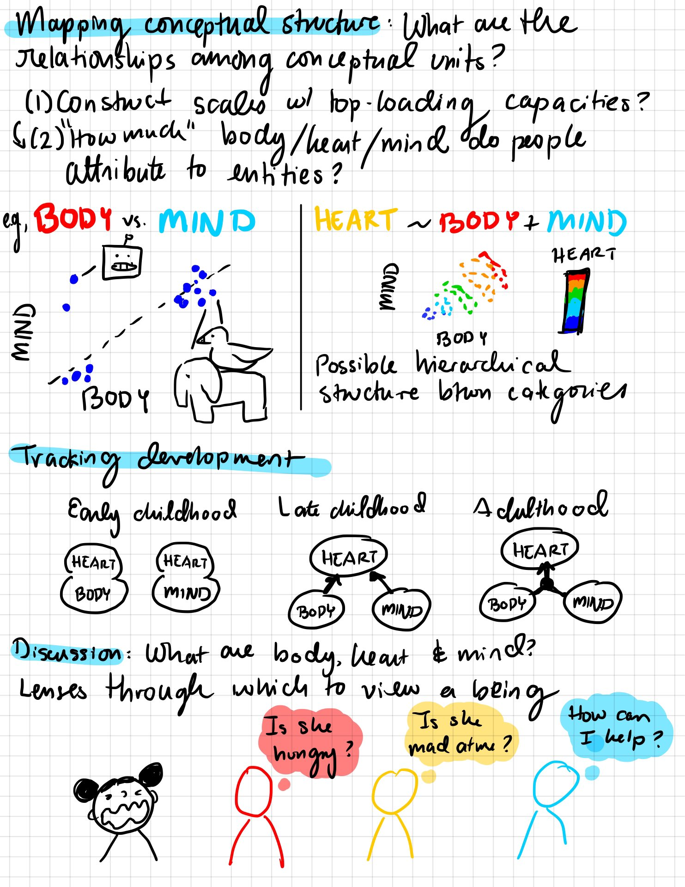

## Kara Weisman

[**email**: [kgweisman at gmail](mailto:kgweisman@gmail.com)] [**twitter**: [@kgweisman](https://twitter.com/kgweisman)] [**cv**: [pdf]({{ kgweisman.github.io }}/pub_files/Weisman_CV_2021-08-01.pdf)]

I study intuitive theories, conceptual change, and folk philosophy of mind, with particular attention to the ways these conceptual representations do and do not vary across development, across cultural settings, and across individuals. I am currently the postdoctoral project director for the [Developing Belief Network](https://www.developingbelief.com/).

* [HOME]({{ kgweisman.github.io }}/index)
* [ABOUT ME]({{ kgweisman.github.io }}/about)
* [PUBLICATIONS]({{ kgweisman.github.io }}/publications)
* [TEACHING]({{ kgweisman.github.io }}/teaching)

### Publications

**_Click [here]({{ kgweisman.github.io }}/pub_files/Weisman_CV_2021-08-01.pdf) to view my full CV._** _Analysis and experiment code for most of my recent studies is available on [Github](https://github.com/kgweisman). Please [email me](mailto:kgweisman@gmail.com) with questions, comments, and ideas._

#### Journal Articles

1. **Weisman, K.**, Legare, C.H., Smith, R.E., Dzokoto, V.A., Aulino, F., Ng, E., Dulin, J.D., Ross-Zehnder, N., Brahinsky, J.D., & Luhrmann, T.M. (in press). Similarities and differences in concepts of mental life among adults and children in five cultures. _Nature Human Behavior_. [[github repo](https://github.com/kgweisman/mental-life-culture-development)]
2. Van Leeuwen, N., **Weisman, K.**, & Luhrmann, T.M. (accepted). To believe is not to think: A cross-cultural finding. _Open Mind: Discoveries in Cognitive Science_. [[github repo](https://github.com/kgweisman/think_believe)]
3. Erickson-Davis, C., Bailenson, J., Corwin, A., Kurina, L., **Weisman, K.**, & Luhrmann, T.M. (2021). The sense of presence: Lessons from virtual reality. _Religion, Brain, & Behavior_. [[link](https://www.tandfonline.com/doi/full/10.1080/2153599X.2021.1953573)] [[pdf]({{ kgweisman.github.io }}/pub_files/Erickson-Davis%20et%20al.%20(2021).pdf)] 
4. Luhrmann, T.M.\*, **Weisman, K.**\*, Aulino, F., Brahinsky, J.D., Dulin, J.C., Dzokoto, V.A., Legare, C.H., Lifshitz, M., Ng., E., Ross-Zehnder, N., & Smith, R.E. (2021). Sensing the presence of gods and spirits across cultures and faiths. _Proceedings of the National Academy of Sciences_, _118_(5), e2016649118.  [*joint first authors] [[github repo](https://github.com/kgweisman/sense_spirit)] [[link](https://www.pnas.org/content/118/5/e2016649118)] [[pdf]({{ kgweisman.github.io }}/pub_files/Luhrmann,%20Weisman,%20et%20al.%20(2021).pdf)] [[Supplemental Info]({{ kgweisman.github.io }}/pub_files/Luhrmann,%20Weisman,%20et%20al.%20(2021)%20-%20SI.pdf)] [[Discussion on "Many Minds" podcast](https://manyminds.libsyn.com/why-some-see-spirits)]
5. **Weisman, K.**\*, & Luhrmann, T.M.\* (2020). What anthropologists can learn from psychologists, and the other way around. _Mind and Spirit: A comparative theory about representation of mind and the experience of spirit_; a special issue of the _Journal of the Royal Anthropological Institute_, _26_(S1). [*joint first authors] [[link](https://rai.onlinelibrary.wiley.com/doi/10.1111/1467-9655.13245)] [[pdf]({{ kgweisman.github.io }}/pub_files/Weisman%20&%20Luhrmann%20(2020).pdf)]
6. Roberts, S.O., **Weisman, K.**, Lane, J.D., Williams, A., Camp, N.P., Wang, M., Robison, M., Sanchez, K., & Griffiths, C. (2020). God as a White man: A psychological barrier to conceptualizing Black people and women as leadership worthy. _Journal of Personality and Social Psychology_, _119_(6), 1290-1315. [[link](https://psycnet.apa.org/record/2020-06604-001)] [[pdf]({{ kgweisman.github.io }}/pub_files/Roberts%20et%20al%20(2020).pdf)]
7. **Weisman, K.**, Dweck, C.S., & Markman, E.M. (2017). Rethinking people's conceptions of mental life. _Proceedings of the National Academy of Sciences_, _114_(43), 11374-11379. [[link](http://www.pnas.org/content/114/43/11374.short)] [[pdf]({{ kgweisman.github.io }}/pub_files/Weisman,%20Dweck,%20&%20Markman%20(2017).pdf)]
8. **Weisman, K.**, & Markman, E.M. (2017). Theory-based explanation as intervention. _Psychonomic Bulletin and Review_, _24_(5), 1555-1562. [[link](https://www.ncbi.nlm.nih.gov/pubmed/28097604)] [[pdf]({{ kgweisman.github.io }}/pub_files/Weisman%20&%20Markman%20(2017).pdf)]
9. Kim, S., Kalish, C.W., **Weisman, K.**, Johnson, M.V., & Shutts, K. (2016). Young children choose to inform previously knowledgeable others. _Journal of Cognition and Development_, _17_(2), 320-340. [[link](http://www.tandfonline.com/doi/abs/10.1080/15248372.2014.952731)] [[pdf]({{ kgweisman.github.io }}/pub_files/Kim,%20Kalish,%20Weisman,%20Johnson,%20&%20Shutts%20(2016).pdf)]
10. **Weisman, K.**, Johnson, M.V., & Shutts, K. (2015). Young children's automatic encoding of social categories. _Developmental Science_, _18_(6), 1036-1043. [[link](http://onlinelibrary.wiley.com/doi/10.1111/desc.12269/full)] [[pdf]({{ kgweisman.github.io }}/pub_files/Weisman,%20Johnson,%20&%20Shutts%20(2015).pdf)] [[FAQs]({{ kgweisman.github.io }}/pub_files/KW%20thoughts%20on%20auto-encoding%20analyses.pdf)]
11. Olson, K.R., Shutts, K., Kinzler, K.D., & **Weisman, K.G.** (2012). Children associate racial groups with wealth: Evidence from South Africa. _Child Development_, _83_(6), 1884-1899. [[link](http://onlinelibrary.wiley.com/doi/10.1111/j.1467-8624.2012.01819.x/abstract)] [[pdf]({{ kgweisman.github.io }}/pub_files/Olson,%20Shutts,%20Kinzler,%20&%20Weisman%20(2012).pdf)]

#### Articles Under Review

12. **Weisman, K.** (under review after revision). Machines with minds: Beliefs about the mental lives of robots and implications for human social reasoning.
13. **Weisman, K.**, King, L.S., & Humphreys, K.L. (submitted). Beliefs about the development of mental life. [[github repo](https://github.com/kgweisman/baby_mental_life_ms), including fully reproducible manuscript and supplemental materials]
14. Powell, D., **Weisman, K.**, & Markman, E.M. (submitted). Modeling and leveraging intuitive theories to improve vaccine attitudes. [[github repo](https://github.com/derekpowell/int-theory-vacc), including fully reproducible manuscript and supplemental materials]
15. Luhrmann, T.M., & **Weisman, K.** (invited submission). Porosity is the heart of religion.
16. Salo, V.C., Letterie, M.C., **Weisman, K.**, King, L.S., & Humphreys, K.L. (under review after revision). Perceptions of children’s mental capacities and self-reported parenting behavior. [[preprint](https://osf.io/8uzxn/)]
17. Richert, R.A., **Weisman, K.**, Ghossainy, M.E., Lesage, K.A., Reyes-Jaquez, B., & Corriveau, K. (invited submission in prep). Researching the Development of Religious Beliefs and Behaviors.

#### Dissertation

Weisman (2019). The development of conceptual representations of mental life. [[link](https://searchworks.stanford.edu/view/13342745)] [[pdf]({{ kgweisman.github.io }}/pub_files/Weisman%20(2019).pdf)] [[4000 word précis]({{ kgweisman.github.io }}/pub_files/Weisman%20(2019%20precis).pdf)]

Sketches of my defense by Natalia Vélez [@natvelali](https://twitter.com/natvelali?s=20):

<blockquote class="twitter-tweet">
Congratulations, Dr. Weisman!! 🎉 <a href="https://twitter.com/kgweisman?ref_src=twsrc%5Etfw">@kgweisman</a> uses a bottom-up approach to (1) discover the “conceptual units” of folk theories of mental life, (2) test how these units are organized, and (3) chart how this organization changes across development. <a href="https://t.co/i2LBTmATmX">pic.twitter.com/i2LBTmATmX</a>
&mdash; Natalia Vélez (@natvelali) <a href="https://twitter.com/natvelali/status/1114268015002931200?ref_src=twsrc%5Etfw">April 5, 2019</a></blockquote> 

#### Other Preprints

1. **Weisman, K.**. Toward a representative and rigorous science of the mind: Notes from a young psychologist on the Mind & Spirit Project. [[preprint]({{ kgweisman.github.io }}/pub_files/Weisman%20(under%20review).pdf)]

#### Refereed Conference Papers

1. **Weisman, K.**, Dweck, C.S., & Markman, E.M. (2021). Emotions as the product of body and mind: The hierarchical structure of folk concepts of mental life among US adults and children. Poster to be presented at CogSci 2021 (virtual meeting) and included in the Proceedings of the 43rd Annual Meeting of the Cognitive Science Society. Austin, TX: Cognitive Science Society.
2. Van Leeuwen, N., **Weisman, K.**, & Luhrmann, T.M. (2020). “Think” and “believe” across cultures: A shared folk distinction between two cognitive attitudes in the US, Ghana, Thailand, China, and Vanuatu. Talk to be presented at CogSci 2020 (virtual meeting) and included in the Proceedings of the 42nd Annual Meeting of the Cognitive Science Society. Austin, TX: Cognitive Science Society. [[link](https://cogsci.mindmodeling.org/2020/papers/0137/0137.pdf)]
3. **Weisman, K.**, Dweck, C.S., & Markman, E.M. (2018). Folk philosophy of mind: Changes in conceptual structure between 4-9y of age. Talk presented at CogSci 2018 (Madison, WI) and included in the Proceedings of the 40th Annual Meeting of the Cognitive Science Society. Austin, TX: Cognitive Science Society. [[link](http://mindmodeling.org/cogsci2018/papers/0229/0229.pdf)]
4. Powell, D., **Weisman, K.**, & Markman, E.M. (2018). Articulating lay theories through graphical models: A study of beliefs surrounding vaccination decisions. Talk presented at CogSci 2018 (Madison, WI) and included in the Proceedings of the 40th Annual Meeting of the Cognitive Science Society. Austin, TX: Cognitive Science Society. [[link](http://mindmodeling.org/cogsci2018/papers/0183/0183.pdf)]
5. **Weisman, K.**, Dweck, C.S., & Markman, E.M. (2017). Children's intuitions about the structure of mental life. Talk presented at CogSci 2017 (London, UK) and included in the Proceedings of the 39th Annual Meeting of the Cognitive Science Society. Austin, TX: Cognitive Science Society. [[link](https://mindmodeling.org/cogsci2017/papers/0256/paper0256.pdf)]
6. **Weisman, K.**, Dweck, C.S., & Markman, E.M. (2016). Varieties of experience: A new look at folk philosophy of mind. Talk presented at CogSci 2016 (Philadelphia, PA) and included in the Proceedings of the 38th Annual Meeting of the Cognitive Science Society. Austin, TX: Cognitive Science Society. [[link](https://mindmodeling.org/cogsci2016/papers/0472/paper0472.pdf)]
7. **Weisman, K.**, Markman, E.M., & Dweck, C.S. (2015). Reasoning about sentience and animacy: Children's and adults' inferences about the properties of unseen entities. Talk presented at CogSci 2015 (Pasadena, CA) and included in the Proceedings of the 37th Annual Meeting of the Cognitive Science Society. Austin, TX: Cognitive Science Society. [[link](https://mindmodeling.org/cogsci2015/papers/0450/paper0450.pdf)]

#### Recent Posters & Presentations
1. **Weisman, K.**, (2021, July). Intuitive theories of emotion: Insights from developmental and cultural comparisons. Talk presented as part of the [“Interdisciplinary Advances in Affective Cognition” pre-conference workshop](https://affcog.github.io/), prior to the Annual Meeting of the Cognitive Science Society, virtual meeting.
2. **Weisman, K.**, Legare, C.H., & Luhrmann, T.M. (2020, July). The development of conceptual representations of mental life in five cultural contexts. Talk presented as part of the [“Cognition, Collectives, and Human Culture” pre-conference workshop](https://cognitioncollectivesandculture.github.io/), prior to the Annual Meeting of the Cognitive Science Society, virtual meeting. [[video](https://cognitioncollectivesandculture.github.io/theme3/2020/07/29/KaraWeisman.html)]
3. **Weisman, K.**, Legare, C.H., & Luhrmann, T.M. (2019, March). Beliefs about the mental lives of supernatural beings: A cross-cultural comparison. Talk presented at the Biennial Meeting of the Society for Research in Child Development, Baltimore, MD.

